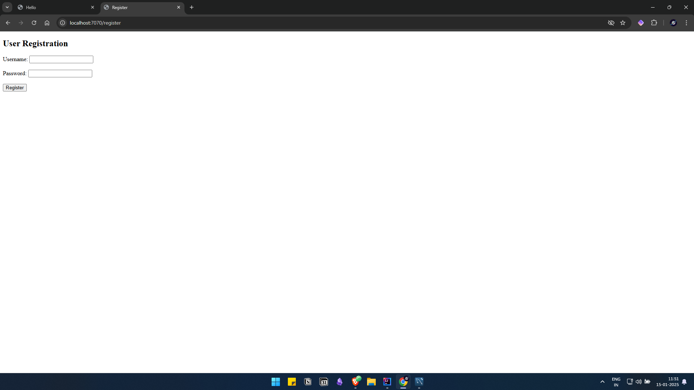

# BookVerse

Simple Spring Boot application for a list of books.
Reviews system yet to be added.
Uses thymeleaf template for frontend.
Basic Python script for recommendations engine.

### Home page

### Login page

### New User Registration

### Add new Book : only available to users registered as admin

##### Features to be implemented : 
1. New book cache which displays new books but does not perform recommendations on it due to no data input
2. Manage books admin only option to delete or update books
3. Authors database table
4. Buy links to redirect to respective websites
5. Wishlist
6. Reviews and Discussions